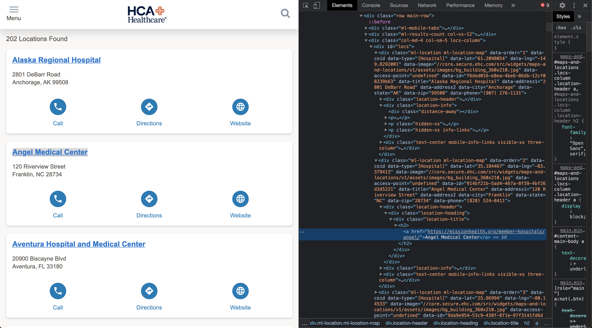

{width=30%}

*****

## HCA Healthcare

HCA (NYSE: HCA) is a for-profit medical facilities operator that owns 186 hospitals and over 2,000 other care sites. HCA was initially public, but went private in 2007 after an insider trading scandal and allegations of making false business claims. The company went public again 3 years later in 2010. The company’s stock has almost doubled in the past year and has shown consistent growth over the past 5 years with a current market cap of over $66 billion. They have benefited heavily from industry tailwinds, as characterized from last year's earning call.

> I think the first point I would make is, we believe, and we've said this, and we continue to believe and we're seeing evidence even in 2019, that there is growing demand for healthcare services in HCA's markets. -Samuel N. Hazen, CEO

In their 10K for FY2019, HCA listed the following as their strategic goals:
- Grow our presence in existing markets
- Achieve industry-leading performance in clinical and satisfaction measures;
- Recruit and employ physicians to meet the need for high quality health services
- Continue to leverage our scale and market positions to grow the Company
- Pursue a disciplined development strategy

In the corresponding earnings call (Jan 28th, 2020), CFO William B. Rutherford describes strong growth in patient volumes (i.e. Medicare admissions grew 4.3% YoY), while holding down operating expenses (operating expenses per equivalent admission grew just 0.8%).

Our thesis: For-profit hospital that should theoretically be generating as much revenue per patient as a not-for-profit hospital (for public payors). However, HCA has an markedly higher incentive to cut down on operating expenses to return value to shareholders.

### Empirical Model

We test our thesis of growth in margins using publicly available datasets on hospital finances. We develop a case study of the Tampa-St. Petersburg metropolitan area given the high concentration of HCA-owned hospitals in the region. We test several outcome variables measuring volumes and opex iusing simple parametric and nonparametric regression models across the years 2015 to 2019. 

## Data

```{r, include=F}
knitr::opts_chunk$set(include = F, message = F, warning = F,
                      echo=F, eval=T, comment=NA, cache=F,
                      rows.print=5
                      #fig.height=4
                      )
```

```{r}
library(tidyverse)
library(MASS)
library(plotly)
library(broom)
```

```{r}
cr <- readr::read_csv('data/HCRIS_2010-2020_processed.csv') %>% select(-X1)
locs <- readr::read_csv('data/hospital-locations.csv')

colnames(locs) <- tolower(colnames(locs))
colnames(cr) <- tolower(colnames(cr))
```

### Cost Reports

We utilize the Health Costs Reporting Information System (HCRIS) database, known colloquially as the Medicare cost reports. The cost reports are filed annually by hospitals to the Centers for Medicare and Medicaid Services (CMS), and are mandated for federally qualified health centers, including hospitals that receive Medicare reimbursement. The cost reports contain valuable information on hospital financial statements: including revenues, discharges, and operating expenses per fiscal year. We obtain cost reports from 2010 through 2020, and implement processing scripts from Ian McCarthy and the National Bureau of Economic Research (NBER) to extract human-readable datasets.

There are `r cr$provider_number %>% unique %>% length` unique hospitals represented across the 10 years, filing over `r  nrow(cr)` cost reports in the ten-year span. A subset of the cost reports for the UVA Health System is shown below:

```{r, include=T}
cr %>% filter(provider_number == 490009, 
              # year %in% 2016:2020
              ) %>% 
  select(starts_with('fy'), beds, 
         tot_discharges, tot_operating_exp, tot_charges, 
         ip_charges, icu_charges, 
         mcare_discharges, mcaid_discharges,
         street, city, state) %>%
  arrange(desc(fy_end))
```

******

### HCA Data

To obtain attributes of HCA-owned hospitals, we scrape public-facing location data from the HCA website using Python scripts. We obtain data on `r nrow(locs)` HCA-owned hospitals nation-wide, including location and contact information.



```{r, include=T}
locs %>% select(-type,-latitude,-longitude,)
```


```{r}
df <- cr %>% mutate(zip5 = substr(zip,1,5)) %>% 
  left_join(locs %>% mutate(provider_name = toupper(title),
                            ownership = 'HCA'
                            ),
             by=c('provider_name'='provider_name','zip5'='zip')) %>%
  mutate(ownership = dplyr::case_when(ownership == 'HCA'~'HCA',T~'Other'),
         ownership = relevel(as.factor(ownership), ref='Other'),
         other_discharges = tot_discharges - mcare_discharges - mcaid_discharges
         ) %>%
  filter(year != 2020) 
```


```{r}
tampa.counties <- c('PASCO',
                    'HILLSBOROUGH','HILLSBORO','HILLSBOURGH',
                    'PINELLAS','PINNELLAS',
                    'HERNANDO')
tampa.zips <- c(33602, 33603, 33604, 33605, 33606, 33607, 33609, 33610, 33611, 33612, 33613, 33614, 33615, 33616, 33617, 33618, 33619, 33620, 33621, 33629, 33634, 33635, 33637, 33647)

tampa.hosp.df <- df %>% filter(county %in% tampa.counties) %>% 
  group_by(provider_number) %>% slice(1) %>% ungroup() 

table(tampa.hosp.df$ownership, tampa.hosp.df$county)

tampa.hosps <- tampa.hosp.df$provider_number
```

```{r}
df.tampa <- df %>% filter(year %in% 2015:2019, provider_number %in% tampa.hosps)
df.tampa
```
```{r, eval=F}
pubs <- c("The Angel, Bermondsey", "The Churchill Arms, Notting Hill", "The Auld Shillelagh, Stoke Newington", "The Sekforde, Clerkenwell", "The Dove, Hammersmith", "The Crown and Sugar Loaf, Fleet Street", "The Lamb, Holborn", "Prince of Greenwich, Greenwich", "Ye Olde Mitre, Hatton Garden", "The Glory, Haggerston", "The Blue Posts, Soho", "The Old Bank of England, Fleet Street")
pubs_df <- data.frame(Pubs = pubs, stringsAsFactors = FALSE)

# run the geocode function from ggmap package

register_google(key = "mQkzTpiaLYjPqXQBotesgif3EfGL2dbrNVOrogg")
pubs_ggmap <- ggmap::geocode(location = pubs, output = "more", source = "google")
pubs_ggmap <- cbind(pubs_df, pubs_ggmap)

# print the results
pubs_ggmap[, 1:6]
```

******

HCA currently owns and operates `r locs %>% filter(state == 'FL') %>% nrow` hospitals in the state of Florida. Use the plot below to explore HCA market penetration in the United States.

```{r, include=T}
df.t <- df %>% 
  # filter(state.x=='FL') %>% 
  filter(ownership == 'HCA') %>%
  group_by(provider_name) %>% 
  arrange(-year) %>%
  slice(1) %>% ungroup()
fig <- df.t

  
fig <- fig %>%
  plot_ly(
    lat = ~latitude,
    lon = ~longitude,
    marker = list(color = "blue", size= 5*(df.t$beds %>% log10)),
    type = 'scattermapbox',
    hovertext = paste0('<b>',df.t$title,'</b>',
                       '<br>Discharges: ',prettyNum(df.t$tot_discharges, big.mark=','),
                       '<br>OpEx: $',prettyNum(round(df.t$tot_operating_exp/1e6,1), big.mark=','),'M',
                       '<br>Beds: ',prettyNum(df.t$beds, big.mark=',')
                 )
    ) 
fig <- fig %>%
  layout(
    mapbox = list(
      style = 'carto-positron',
      zoom =8,
      center = list(lon = -82.5, lat = 27.9)),
   margin = list(l = 25, r = 25,
                 b = 25, t = 25,
                 pad = 2)
    ) 

fig
```

We define the Tampa-St.Petersburg market as the four adjacent counties: Pasco, Hillsborough, Pinellas, and Hernando. Of the 41 hospitals in the region in 2019, 8 are HCA-owned (20%).

## Statistical Modelling

We first model Medicare discharges in the region, controlling for year effects using a M-estimator robust least-squares (RLM) design. We find a significant coefficient associated with HCA ownership.

```{r, include=T}
library(sjPlot)
mcare.dis.lm <- rlm(mcare_discharges ~ ownership+year,df.tampa)
mcare.dis.lm %>% tab_model(dv.labels = 'Medicare Discharges',
                           pred.labels	= c('Intercept','HCA Ownership','Year Effect')
                           )
```

We find no such effect when modeling Medicaid volumes.

```{r, include=T}
mcaid.dis.lm <- MASS::rlm(mcaid_discharges ~ ownership+year,df.tampa)
mcaid.dis.lm %>% tab_model(dv.labels = 'Medicaid Discharges',
                           pred.labels	= c('Intercept','HCA Ownership','Year Effect')
                           )
```

We then impute other discharges,  accounting for commercial patients and uncompensated care. Standardizing these values against hospital size, we find no significant effect of HCA ownership.

```{r, include=T}
other.dis.lm <- MASS::rlm(other_discharges/beds ~ ownership+year,df.tampa)
other.dis.lm %>% tab_model(dv.labels = 'Commercial and Uncompensated Discharges per Bed',
                           pred.labels	= c('Intercept','HCA Ownership','Year Effect')
                           )
```

We model operating expenses per discharge, a proxy for spend per patient.

```{r, include=T}
opex.lm <- lm(tot_operating_exp/tot_discharges~ownership+year,
   data=df.tampa
   )
opex.lm %>% tab_model(dv.labels = 'Total OpEx per Discharge',
                      pred.labels	= c('Intercept','HCA Ownership','Year Effect')
)
```


## Conclusions

Our analysis serves as a rough retrospective analysis of a top-tier healthcare company. Using federally-audited data, we match per-firm financial performance to corporate growth strategies implemented by leadership. In a case study of the Tampa market, we find preliminary evidence to support volume growth in some operating segments, notably with Medicare. Strikingly, we observe strong evidence of lower operating expenses per patient, supporting HCA's ability to drive growth while suppressing costs at a per-facility level.

There are several limitations with our approach. While we drill-down to the Tampa market to maintain similar patient and payor mixes (disease profiles of the population, and insurance preferences in the region), we are unable to extend our conclusions to other markets (i.e. Dallas-Fort Worth) without further investigation. Furthermore, we omit several key covariates, and do not match observations on hospital attributes. In other words, Medicare patients may be self-selecting into HCA hospitals based on population distributions, referral networks, or hospital size, not necessarily because of HCA marketing or leadership.


******
{width=25%}
